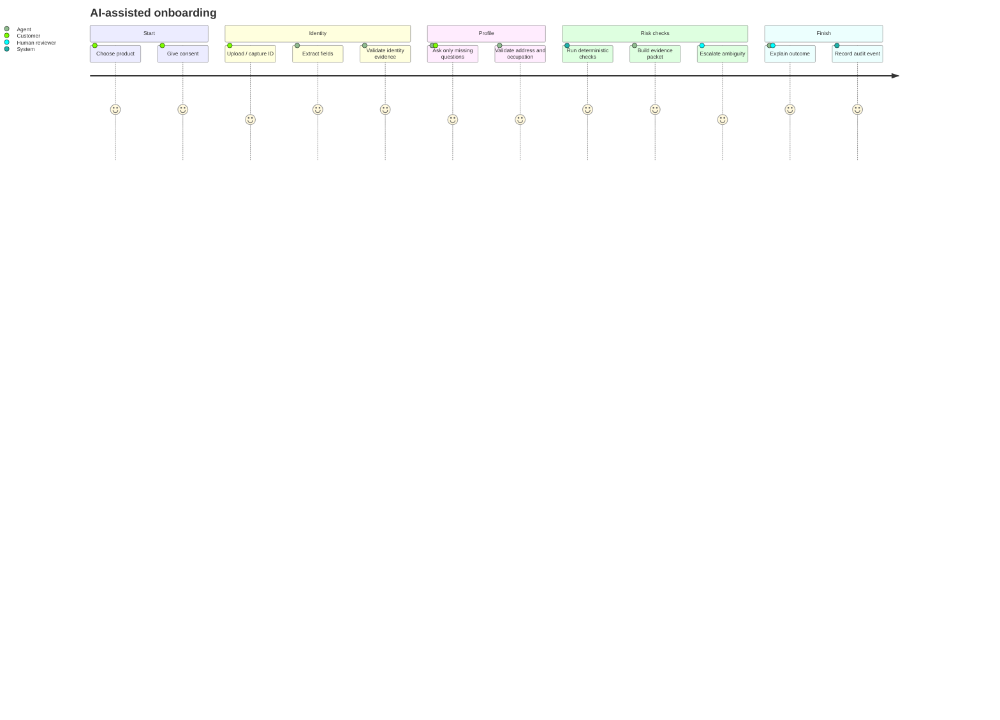
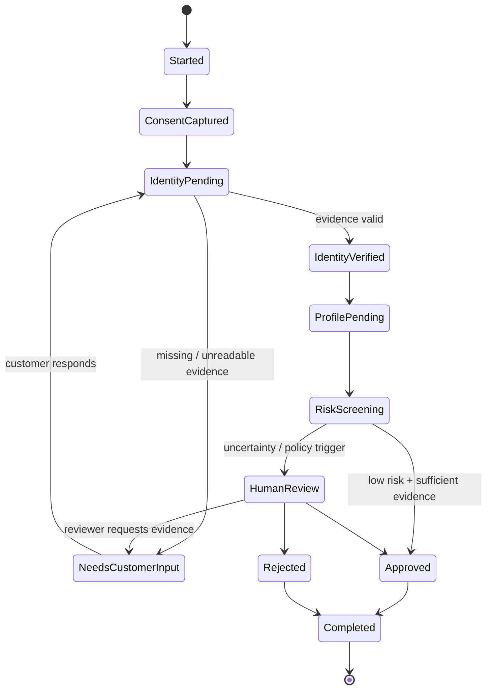
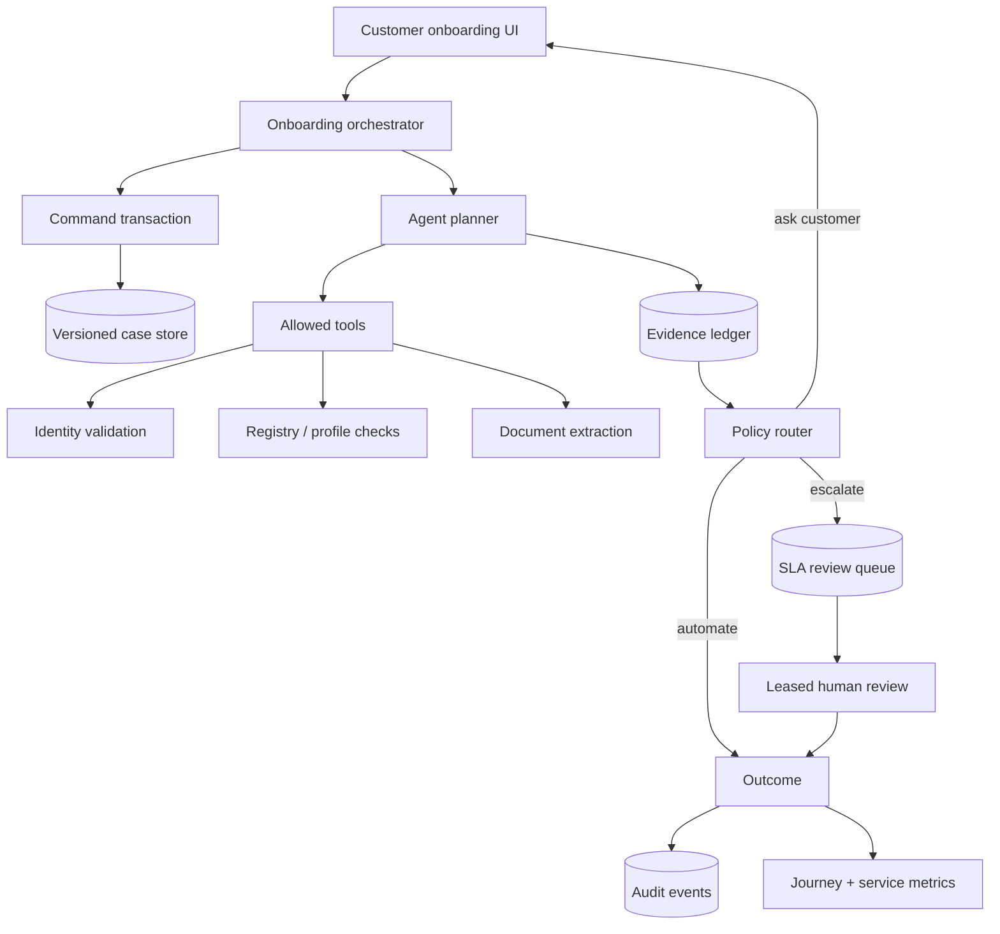

# Agentic Onboarding Lab

A reference implementation for **AI-assisted customer onboarding** where an agent coordinates evidence collection, validation, next-best-action selection and human escalation.

The goal is not to automate every decision. The goal is to make the onboarding service faster while keeping decision authority, evidence provenance and escalation policy explicit.

## Customer journey



## State machine



## Agent responsibilities

The onboarding agent can:

- identify missing information;
- choose the next best question;
- normalize evidence into structured fields;
- execute allowed validation tools;
- summarize evidence for a reviewer;
- recommend a route;
- generate customer-facing status messages;
- persist an audit trail.

The agent **cannot** silently override mandatory-review policy, delete evidence, weaken validation rules or convert uncertainty into an automatic approval.

## Architecture



## Reliability contracts

This implementation treats a state transition as a command, not a CRUD overwrite:

- every case has a monotonically increasing `version`;
- `If-Match` rejects decisions based on stale customer or reviewer screens;
- state and the embedded audit event commit in the same SQLite transaction;
- `Idempotency-Key` receipts make timeout retries safe without duplicate evidence or audit events;
- escalation creates a durable review task in the same case transaction;
- reviewers claim work through expiring leases, so abandoned tasks re-enter the queue;
- queue order is deterministic: priority descending, then SLA deadline, then arrival time;
- outcome is stored separately from the terminal `completed` stage.

These boundaries remain useful if SQLite is replaced by PostgreSQL: the compare-and-swap update,
command receipt and lease acquisition map directly to conditional updates and row locking.

## Important service-design metrics

- completion rate;
- average onboarding time;
- abandonment by journey stage;
- percentage of questions skipped because data already exists;
- manual-review rate;
- agent/human disagreement rate;
- evidence-request loops per case;
- percentage of cases with actionable explanations;
- SLA breach rate;
- automation rate by impact tier.

`GET /metrics/journey` derives its current snapshot from case audit histories and durable queue
records. It reports completion and human-review rates, automated/reviewer decisions, evidence
density, stage distribution, queued/leased work and SLA breaches. Metrics are recomputable rather
than increment-only counters that drift after retries.

## API workflow

```bash
# create a case (version starts at 1)
curl -s -X POST localhost:8000/cases \
  -H 'content-type: application/json' \
  -d '{"product":"Everyday Banking","customer_type":"retail"}'

# retry-safe transition based on the version rendered to the customer
curl -s -X POST localhost:8000/cases/ONB-.../consent \
  -H 'content-type: application/json' \
  -H 'If-Match: 1' \
  -H 'Idempotency-Key: consent-ONB-...-1' \
  -d '{"accepted":true}'

# reviewer work distribution
curl -s -X POST localhost:8000/reviews/claim \
  -H 'content-type: application/json' \
  -d '{"reviewer":"analyst-17","lease_minutes":15}'
```

A repeated idempotency key returns `idempotent_replay: true`. A stale version, reused key from
another case, illegal state transition or invalid reviewer lease returns HTTP 409.

## Repository layout

```text
agentic-onboarding-lab/
├── onboarding.py          # policy-bounded state machine and evidence model
├── service/
│   ├── api.py             # HTTP command and reviewer-queue boundary
│   ├── store.py           # transactional versioning and command receipts
│   ├── reviews.py         # priority/SLA queue and expiring leases
│   └── metrics.py         # audit-derived operational metrics
├── tests/
│   ├── test_api.py        # end-to-end customer and reviewer journeys
│   ├── test_concurrency.py# stale-writer and thread-race regressions
│   ├── test_reviews.py    # queue ordering, expiry and ownership
│   └── test_metrics.py    # service KPI derivation
├── onboarding_ui.html     # static customer journey prototype
├── Dockerfile             # non-interactive production service image
└── .github/workflows/ci.yml
```

## Demo

```bash
python -m venv .venv
.venv/bin/pip install -e '.[dev]'
.venv/bin/ruff check .
.venv/bin/pytest -q
.venv/bin/uvicorn service.api:app --reload
```

CI also builds the wheel, installs it outside the repository, imports the installed API, builds
the container and executes a container-level application import smoke test.

All demo identities and evidence are synthetic. This project contains no real customer or employer information.


## Tamper-evident audit checkpoints

`audit_integrity.build_checkpoint` canonicalizes each audit event and commits it to a
SHA-256 chain that includes all preceding history. Store the returned terminal digest
and event count outside the case database—for example in immutable object storage or a
separate compliance ledger—and later call `verify_checkpoint` against that trusted value.

The verifier detects event mutation, deletion, insertion, and reordering, returns
machine-readable failure reasons, rejects non-canonical values such as NaN, and versions
the checkpoint schema. Dictionary key order does not affect the result.

A hash checkpoint is an integrity signal, not identity or authorization. If an attacker
can alter both the case database and the external checkpoint, verification cannot detect
the rewrite. Production deployments should protect checkpoints with an independently
controlled write-once store, signature service, or KMS-backed MAC.
