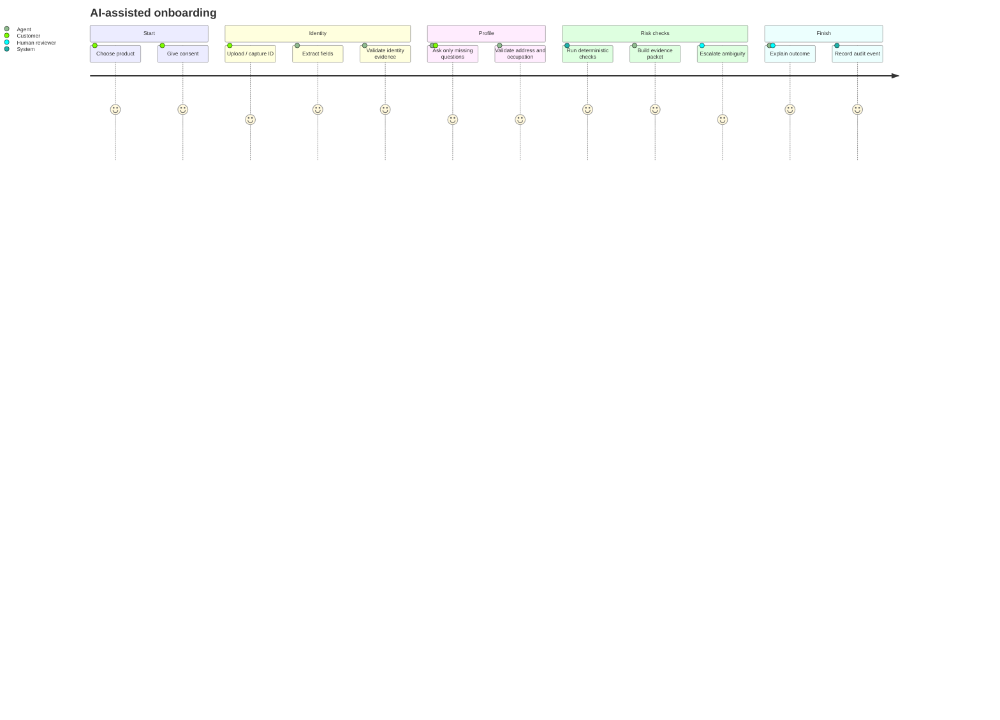
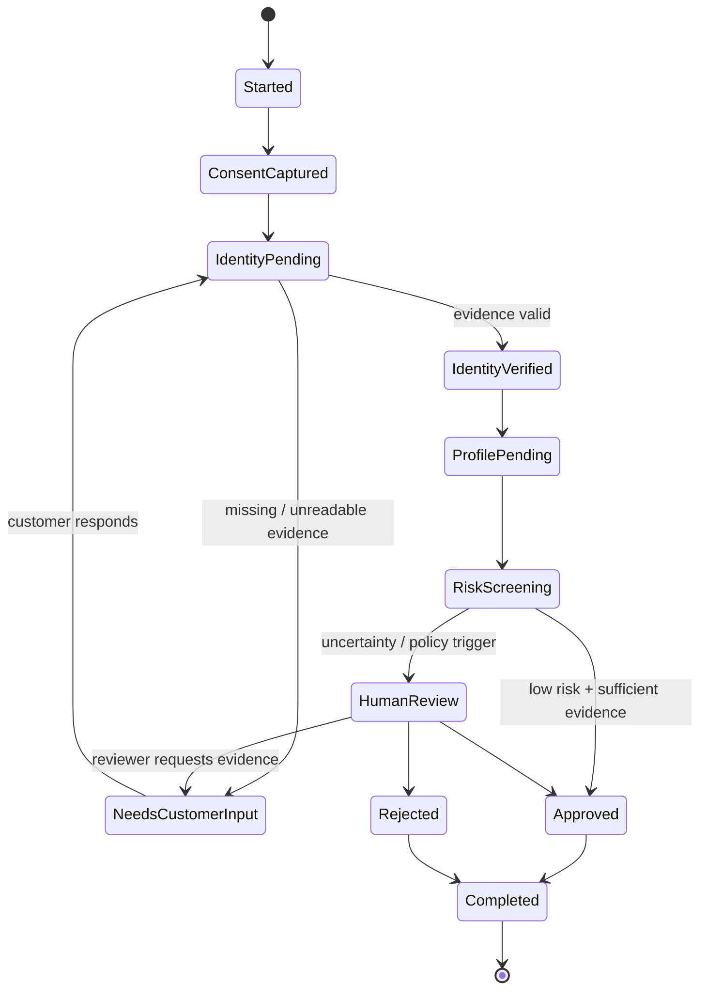
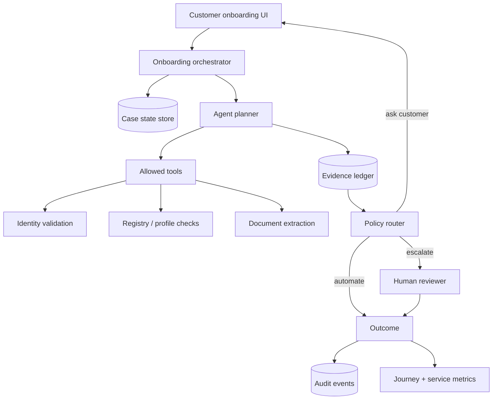

# Agentic Onboarding Lab

A reference implementation for **AI-assisted customer onboarding** where an agent coordinates evidence collection, validation, next-best-action selection and human escalation.

The goal is not to automate every decision. The goal is to make the onboarding service faster while keeping decision authority, evidence provenance and escalation policy explicit.

## Customer journey



## State machine



## Agent responsibilities

The onboarding agent can:

- identify missing information;
- choose the next best question;
- normalize evidence into structured fields;
- execute allowed validation tools;
- summarize evidence for a reviewer;
- recommend a route;
- generate customer-facing status messages;
- persist an audit trail.

The agent **cannot** silently override mandatory-review policy, delete evidence, weaken validation rules or convert uncertainty into an automatic approval.

## Architecture



## Important service-design metrics

- completion rate;
- average onboarding time;
- abandonment by journey stage;
- percentage of questions skipped because data already exists;
- manual-review rate;
- agent/human disagreement rate;
- evidence-request loops per case;
- percentage of cases with actionable explanations;
- SLA breach rate;
- automation rate by impact tier.

## Repository layout

```text
agentic-onboarding-lab/
├── onboarding.py       # state machine, evidence and orchestration
├── onboarding_ui.html  # static customer journey prototype
└── README.md
```

## Demo

```bash
python onboarding.py
```

All demo identities and evidence are synthetic. This project contains no real customer or employer information.
